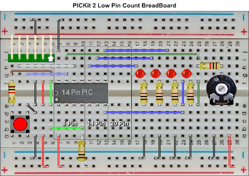

# 16f18126 Demos for Great-Cow-BASIC

# Great-Cow-BASIC

This GIT contains the latest demonstrations.

The baseline set of demonstrations was created at version 1.00.xx of the Great Cow BASIC distribution.

Enjoy

# Layout of Demo programs

This is the standard program. This is included in every Great Cow BASIC installation.  See IDE/Snippets.

----
    '''A program  for GCGB and GCB the demonsations......
    '''--------------------------------------------------------------------------------------------------------------------------------
    '''This program a decription of the demonstration
    '''
    '''@author     [a name]
    '''@licence    GPL
    '''@version    [a version]
    '''@date       [a date]
    '''********************************************************************************

    ; ----- Configuration
     #chip 16f18126
     #config [if required, not normally required]
     #include [required when using specific libraries]

     #option explicit

    ; ----- Constants
       ' [lots of these]

    ; ----- Define Hardware settings
      ' [some times lots of this]

    ; ----- Variables
      ' No Variables specified in this example. All byte variables are defined upon use.
      ' [some times lots of these]

    ; ----- Main body of program commences here.

    [some times lots of this!]

    [end]
    ; ----- Support methods.  Subroutines and Functions
----

# Support for Peripheral Programming Support (PPS)

The PPS method needs to go at the top of the program.

The PPS method must show the version of the PPSTool used to generate the method.

Porting to another microcontroller is easier as the user can locate the PPS method and modify or remove.

# Prototype Board used

We used the PICKit2 Low Pin Count Demo board.  But, you can make your own like this - thank you Chris Roper.

See Figure A.1 in the [PICKIT2 Low Pin Count Demo Board User’s Guide](http://ww1.microchip.com/downloads/en/DeviceDoc/Low%20Pin%20Count%20User%20Guide%2051556a.pdf) for the full details of the layout.
